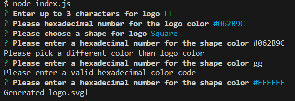
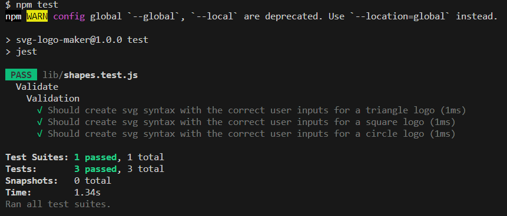

# SVG Logo Maker
  

  ## Description
  This application takes user input from the command line to generate a simple logo as a SVG file. 

  The application was created using the following criteria:
  - When prompted for a logo name up to 3 character can be entered
  - When prompted for a shape can choose from circle, square, triangle 
  - A hexidecimal code is validated for shape and logo color
  - After all prompts entered a SVG file is created with name logo.svg

  ## Table of Contents
- [Installation](#installation)
- [Usage](#usage)
- [License](#license)
- [Contributing](#contributing)
- [Tests](#tests)

 
## Installation
In order to use the application node.js will need to be installed.  
Node.js Installation: https://nodejs.org/en/download 

The inquirer package was used to ask questions and get user input from command line. 

## Usage
Type node index.js into the terminal in order to run the program. Answer the prompts with the information for your logo. If information is entered incorrectly an error message will display and the question will reappear. When the application is finished running the logo will be generated with the name logo.SVG. 
 
 
 

## License 
MIT License

## Contributing
The following websites were used for reference to create this application: 
https://1stwebdesigner.com/create-simple-shapes-svg/

## Tests
Tests for this application were performed using Jest. To run tests type npm test into the terminal. The tests will make sure that the classes output matches what is expected to create the logo in SVG. 

[Walk Thru Video Demonstration](https://drive.google.com/file/d/1f3VcUmUGQX7fj6JhhbNmmZ1EA1N0W1DF/view)

